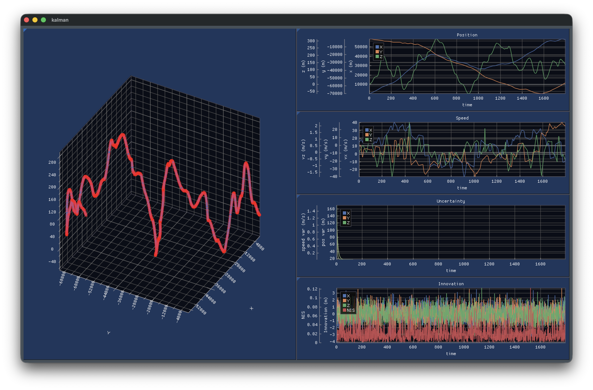

# ft_kalman

**ft_kalman** is a Kalman Filter–based trajectory estimator.

A simulated **Inertial Measurement Unit (IMU)** send noisy sensor data and requires estimation of a vehicle’s 3D position in real time using a **Kalman Filter**.

## ⚙️ Features

- **3D Trajectory Tracking**: Estimation vehicle position `(X, Y, Z)` over long trajectories (up to 90 minutes).
- **Real-Time Estimation**: Communication over UDP, with average response time < ~10 μs.
- **Real-time GUI**: Real-time display of vehicle 3d trajectory, speed, filter error and innovation.
- **Robust Error Handling**: Handles timeouts, invalid states, and estimation failures without crashes or memory leaks.

## 🧠 Learning Objectives

- Understand and implement a **Kalman Filter** from scratch
- Work with **state vectors**, **transition models**, and **covariance matrices**
- Apply **linear algebra** to real-world estimation problems
- Handle **noisy sensor data** and uncertainty propagation
- Implement **real-time communication** using UDP
- Write fast, stable, and memory-safe low-level code
- Implementation of GUI with ImGui-rs
